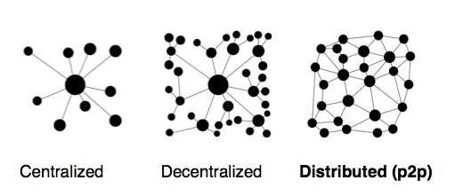

### Daniel Krawisz

#### Capitulo 1 - A estratégia  
  
May 22, 2013

### Empreendedorismo Libertário

Liberdade é uma ideologia para todos. Ela beneficia todas as pessoas e grupos que o objetivo não requer violência. Todas as objeções a liberdade simplesmente estimularam exercícios mentais sobre o que é possível alcançar com organizações voluntarias e como elas são muito melhores em oferecer serviços que originalmente só eram possíveis pelo governo. Movimentos que em uma época eram considerados incompatíveis com o libertarianismo, como feminismo e ambientalismo [1], agora tem seus próprios braços no libertarianismo. Liberdade é como uma droga.

Mesmo assim a maioria das pessoas não escuta. O ideal de liberdade é muito abstrato para eles: a maioria das pessoas necessita experimentar liberdade antes de deseja-la. Por exemplo, quando o Napster foi inventado, repentinamente ao redor do mundo as pessoas ignoraram a opressão dos direitos autorais. Elas experimentaram o doce gosto da liberdade. Uma vez que experimentaram, não conseguiram mais largar.

O objetivo do empreendedor libertário é dar um gosto as pessoas, não influenciando políticos, mas fazendo politica irrelevante. É construir bens de capital para o agorismo, e leva-lo para as massas. Isso requer uma abordagem que é mais precisa que o principio de não agressão sem que o contradiga. Existe mais a ser considerado do que se uma organização é voluntaria ou não: duas organizações podem sem igualmente voluntarias, porém não iguais quanto a sua vulnerabilidade a ataques do governo.[2]

Peguemos, por exemplo, uma empresa que a comunidade adora os serviços de uma empresa que requer que as pessoas renunciem o controle das suas armas e terras para ela. Uma empresa dessas pode continuar, em teoria, sendo voluntaria, porém só um idiota pensaria assim. Uma empresa dessas seria facilmente corrompida ou se transformando em um governo ou fazendo um conluio com um governo existente. Não existe base para criticar uma empresa dessas somente seguindo a ética libertaria, mas a partir do momento que a empresa começar a ser coercitiva, provavelmente será tarde de mais. Um empreendedor libertário deveria se opor a sua forma e urgentemente desenvolver uma alternativa para competir com ela.

O empreendedor libertário deve identificar as industrias com o maior nível de risco e as transformar em algo com menos risco. Existem três modos de que uma indústria pode ser perigosa. Primeiro, se o governo ira ter um grande beneficio controlando ela. Existem algumas industrias que o governo gosta mais do que outras: polícia, educação e transporte são um tanto perigosas. Segundo, se a indústria for centralizada. O governo só tem que fazer um conluio com as maiores empresas para tomar o controle. Terceiro, uma indústria que funciona de tal maneira que aumenta a dependência do consumidores. Se for muito inconveniente de mudar de uma indústria para outra, então as pessoas vão ficar dependentes dela, mesmo que a empresa se corrompa.

Se uma ideia empreendedora for ser adotada, ela deve ser atrativa para pessoas que não tem medo do perigo do governo. É inaceitável propor para as pessoas pararem de colocar dinheiro no banco e usar somente moedas de ouro, como Rothbard e Mises faziam. O empreendedor libertário deve estimular simultaneamente a divisão de trabalho e diminuir o risco. Mesmo com um tanto de sucesso o movimento do homeschooling ele nunca vai conseguir mudar diretamente o controle das escolas publicas sobre as crianças. Uma ideia que promove atomismo deixa todos mais em uma situação pior. É difícil de vender a ideia e no final ela acaba se destruindo. Reclusos não tem chance contra o estado como um todo.

### Criptoanarquia

O movimento criptoanarquista [3], que no começo foi influenciando por teorias anarco capitalistas [4], pode ser resumido em que criptografia nos oferece uma enorme oportunidade para espalhar o gosto da liberdade. Criptoanarquia não é um braço da teoria libertária e sim uma estratégia. É um método de ação. As ferramentas criptográficas que temos atualmente são baratas, poderosas e profundamente individuais. Ninguém pode ameaçar uma equação com uma arma. Um software criptográfico vai funcionar de acordo com as leis da matemática, não importa a vontade do governo. Enquanto for possível distribuir software, vai ser possível, através desse software, dar o gosto de liberdade as pessoas.

Criptografia deve ser pensada como uma ferramenta para criar comunidades e não de sigilo. Sempre tem algo que é um segredo, mas não precisa ser uma mensagem. Em vez disso, ela pode funcionar como a chave de um carro: sua forma é arbitrária e sem sentido, porém seu desenho é associado com uma fechadura de uma máquina que não funciona sem ela. Uma máquina que esta trancada por uma chave não consegue pegar no tranco.

Criptografia promove independência por reduzir a necessidade de se confiar em força para sua defesa. É fácil construir uma chave que não poderia ser quebrada nem se um computador do tamanho do planeta Terra rodasse por milhões de anos. Isso deixa o governo para fora de coisas que necessitam dessa chave para funcionar. Criptografia promove descentralização, reduzindo a necessidade de uma terceira parte. Um protocolo bem escrito é suficiente para que as pessoas cooperem e façam com que cumpram com suas obrigações.

Numa democracia, a visão de um individuo não consegue mudar o mundo. Por esse motivo política é inadequada para libertários. Por outro lado, no livre mercado, um empreendedor pode mudar o mundo. É ai onde os libertários estão em espirito. Com criptografia, um inventor libertário pode criar uma sociedade libertária inteira.

[_Capítulo 2: Public-Key Cryptography_](https://nakamotoinstitute.org/mempool/crypto-anarchy-and-libertarian-entrepreneurship-2/ "Crypto-Anarchy and Libertarian Entrepreneurship – Chapter 2: Public-Key Cryptography") [_Capitulo 3: The Killer App of Liberty_](https://nakamotoinstitute.org/mempool/crypto-anarchy-and-libertarian-entrepreneurship-3/ "Crypto-Anarchy and Libertarian Entrepreneurship – Chapter 3: The Killer App of Liberty") [_Capítulo 4: The Risk From the Software Industry_](https://nakamotoinstitute.org/mempool/crypto-anarchy-and-libertarian-entrepreneurship-4/ "Crypto-Anarchy and Libertarian Entrepreneurship – Chapter 4: The Risk From the Software Industry")

### Notas:

1.  Veja Long, R., Johnson, C., ["Libertarian Feminism: Can This Marriage Be Saved?"](http://charleswjohnson.name/essays/libertarian-feminism/), 1 de maio de 2005 para uma visão libertaria do feminismo. Veja Block, W., ["Environmentalism and Economic Freedom: The Case for Private Property Rights"](http://mises.org/etexts/environfreedom.pdf), vol. 17, Journal of Business Ethics, 1998, páginas 1887-1899 para um argumento em prol de ambientalismo libertário.
2.  Quando eu digo "ataque governamental" não estou implicando que o governo foi quem começou. Os lideres das industrias podem ser os que começaram. Não importa quem tomou a iniciativa, é um ataque governamental, pois o governo é usado como uma arma para mudar o foco dos interesses da empresa dos consumidores para outro lugar
3.  Veja Ludlow, [Crypto Anarchy, Cyberstates, and Pirate Utopias](http://monoskop.org/images/4/42/Ludlow_Peter_Crypto_Anarchy_Cyberstates_and_Pirate_Utopias.pdf), Massachusetts Institute of Technology, 2001 para uma antologia de trabalhos relacionados a criptoanarquia, tanto favoráveis quanto contrários. Na verdade, eu não gosto desse livro. Ele explica pouco sobre criptografia e contém pouca coisa que um anarco capitalista já não saberia. Entretanto, é o único livro publicado sobre criptoanarquia, pelo menos tem isso.
4.  Veja May, T., ["The Cyphernomicon"](https://nakamotoinstitute.org/static/docs/cyphernomicon.txt), 1994, por uma dos primeiros escritores sobre criptoanarquia. Veja o texto dele ["O Manifesto Criptoanarquista"](https://cypherpunks.com.br/o-manifesto-criptoanarquista/), 1988, para um curto, porém marcante declaração sobre criptoanarquia

Fonte: [Crypto-Anarchy and Libertarian Entrepreneurship - Chapter 1: The Strategy](https://nakamotoinstitute.org/mempool/crypto-anarchy-and-libertarian-entrepreneurship-1/)